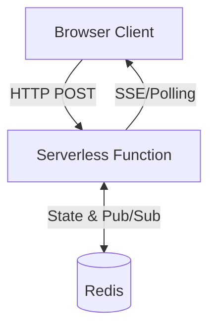
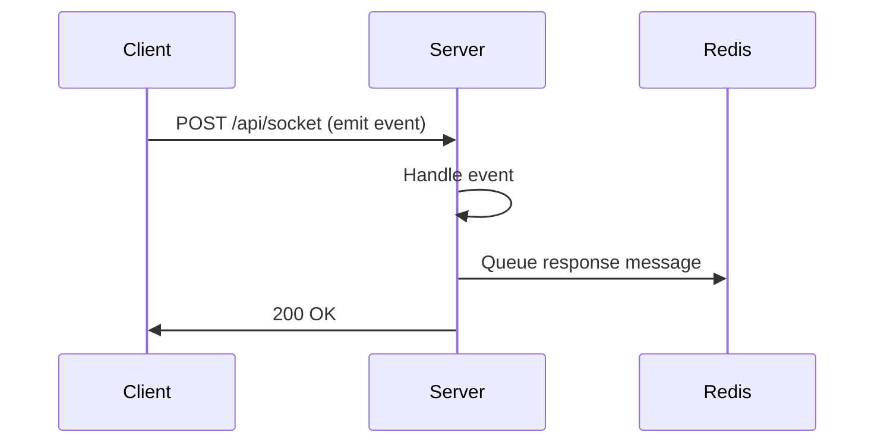
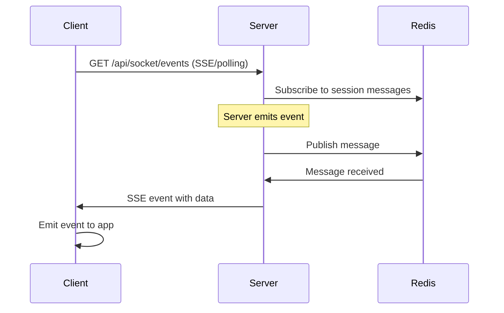
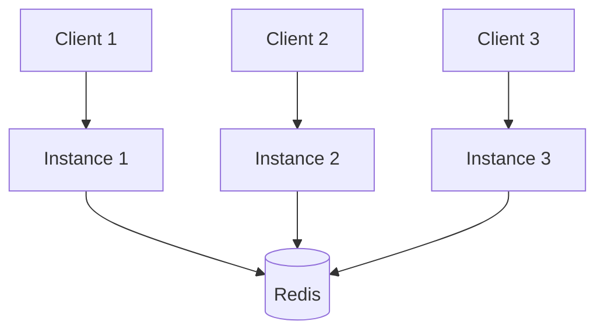

## Overview

socket-serve is designed to bring WebSocket-like real-time functionality to serverless environments where traditional persistent connections aren't possible. It achieves this through a clever combination of HTTP-based transports and Redis for state management.

## High-Level Architecture



## Core Components

### 1. Client SDK (`socket-serve/client`)

The browser-side SDK that provides a socket.io-like API:

```typescript
import { connect } from 'socket-serve/client';

const socket = connect('/api/socket');
socket.emit('message', data);
socket.on('response', handler);
```

**Features:**
- Automatic reconnection with exponential backoff
- Multiple transport support (SSE, polling)
- Event-based API
- Message acknowledgments
- Connection state management

### 2. Server Core (`socket-serve`)

The server-side implementation that runs in your serverless functions:

```typescript
import { createSocketServer } from 'socket-serve';

const server = createSocketServer({
  redisUrl: process.env.REDIS_URL!
});

server.on('connection', (socket) => {
  // Handle client connections
});
```

**Features:**
- Event-driven architecture
- Room-based broadcasting
- Session management
- Message routing

### 3. Adapters (`socket-serve/adapters`)

Framework-specific adapters that integrate with your server:

- **Next.js Adapter**: Creates GET/POST route handlers for App Router
- **Express Adapter**: Middleware for Express.js applications

```typescript
// Next.js
import { createNextJSAdapter } from 'socket-serve/adapters';
export const { GET, POST } = createNextJSAdapter(server);

// Express
import { createExpressAdapter } from 'socket-serve/adapters';
app.use('/socket', createExpressAdapter(server));
```

### 4. Redis State Manager

Manages distributed state across serverless instances:

```typescript
class RedisStateManager {
  // Session management
  saveSession(sessionId, data)
  getSession(sessionId)
  
  // Room management
  joinRoom(sessionId, room)
  leaveRoom(sessionId, room)
  
  // Message pub/sub
  publish(channel, message)
  subscribe(channel, handler)
}
```

## Communication Flow

### Client → Server

When a client sends a message:

1. Client calls `socket.emit('event', data)`
2. Client SDK makes HTTP POST to server endpoint
3. Server receives message and emits event
4. Event handler processes the message
5. Response is queued for the client



### Server → Client

When a server sends a message:

1. Server calls `socket.emit('event', data)`
2. Message is stored in Redis queue for that session
3. Client's active connection (SSE/polling) receives message
4. Client SDK emits event to application



## Transport Mechanisms

### Server-Sent Events (SSE)

**Primary transport** for server → client communication:

- Long-lived HTTP GET connection
- One-way: server → client only
- Automatic reconnection built-in to browsers
- Lower latency than polling

```javascript
// Client establishes SSE connection
const eventSource = new EventSource('/api/socket/events');

eventSource.onmessage = (event) => {
  const data = JSON.parse(event.data);
  handleMessage(data);
};
```

### HTTP Polling

**Fallback transport** when SSE isn't available:

- Regular HTTP GET requests (every 1 second)
- Works in all environments
- Higher latency than SSE
- More resource-intensive

```javascript
// Client polls for messages
setInterval(async () => {
  const response = await fetch('/api/socket/poll');
  const messages = await response.json();
  messages.forEach(handleMessage);
}, 1000);
```

## State Management

### Session State

Each connected client has a session stored in Redis:

```typescript
interface SessionState {
  id: string;              // Unique session ID
  rooms: Set<string>;      // Rooms the client has joined
  connected: boolean;      // Connection status
  lastSeen: number;        // Timestamp of last activity
}
```

**Redis Keys:**
- `session:{sessionId}` - Session data
- `session:{sessionId}:rooms` - Set of joined rooms
- `room:{roomName}` - Set of sessions in room

### Message Queue

Messages are queued in Redis until delivered:

```typescript
interface QueuedMessage {
  id: string;              // Unique message ID
  event: string;           // Event name
  data: any;               // Message payload
  timestamp: number;       // When message was created
  requiresAck?: boolean;   // Needs acknowledgment
}
```

**Redis Keys:**
- `messages:{sessionId}` - List of pending messages
- `ack:{messageId}` - Acknowledgment tracking

### Pub/Sub for Broadcasting

Room broadcasting uses Redis pub/sub:

```typescript
// Server publishes to room
socket.broadcastToRoom('lobby', 'user-joined', { userId });

// Redis channels:
// - room:lobby - Messages for lobby room
// - broadcast:* - Global broadcasts
```

## Scaling

socket-serve scales horizontally by design:

### Multiple Serverless Instances

Each serverless function instance:
1. Connects to shared Redis
2. Subscribes to relevant pub/sub channels
3. Handles requests independently
4. Shares state via Redis



### Stateless Functions

No state is stored in serverless functions:
- All state in Redis
- Functions can scale to zero
- No sticky sessions needed
- Automatic failover

## Reconnection Strategy

Clients automatically reconnect using exponential backoff:

```typescript
const delays = [
  0,      // Immediate (1st attempt)
  2000,   // 2s (2nd attempt)
  4000,   // 4s (3rd attempt)
  8000,   // 8s (4th attempt)
  16000,  // 16s (5th attempt)
  30000   // 30s (max, all subsequent)
];
```

**Reconnection Logic:**
1. Connection lost detected
2. Wait according to backoff schedule
3. Attempt reconnection
4. If successful: reset counter
5. If failed: increment counter and retry
6. Give up after 5 attempts (configurable)

## Message Acknowledgments

Request/response pattern with timeouts:

```typescript
// Client requests with ack
socket.emit('getData', { id: 123 }, (response) => {
  console.log('Server responded:', response);
});

// Server responds to ack
socket.on('getData', (data, ack) => {
  const result = fetchData(data.id);
  ack({ success: true, data: result });
});
```

**Flow:**
1. Client sends message with unique ID
2. Sets 5-second timeout
3. Server receives and processes
4. Server calls ack callback
5. Ack message sent back with same ID
6. Client matches ID and calls callback
7. Timeout cleared

## Performance Characteristics

### Latency

- **SSE**: 50-200ms (depends on network)
- **Polling**: 1000ms average (1s interval)
- **Redis operations**: Less than 10ms typically

### Throughput

- Limited by Redis performance
- Typical: 10,000+ messages/second
- Scales with Redis cluster size

### Resource Usage

**Client:**
- SSE: 1 persistent connection
- Polling: 1 request/second
- Minimal memory footprint

**Server:**
- No persistent connections
- Redis connection pool
- Scales to zero when idle

## Comparison with WebSockets

| Aspect | WebSocket | socket-serve |
|--------|-----------|--------------|
| Connection | Persistent TCP | HTTP-based |
| Serverless | ❌ No | ✅ Yes |
| Bi-directional | ✅ Native | ✅ Via SSE/POST |
| Scaling | Complex | Automatic |
| Latency | Lower (~10-50ms) | Higher (~50-200ms) |
| Compatibility | Some proxies block | Works everywhere |
| State | In-memory | Redis-backed |

## Next Steps

<CardGroup cols={2}>
  <Card
    title="Transports"
    icon="arrows-turn-to-dots"
    href="/concepts/transports"
  >
    Deep dive into SSE and polling
  </Card>
  <Card
    title="State Management"
    icon="database"
    href="/concepts/state-management"
  >
    Learn about Redis state management
  </Card>
  <Card
    title="Rooms"
    icon="users"
    href="/concepts/rooms"
  >
    Understand room-based broadcasting
  </Card>
  <Card
    title="Deployment"
    icon="rocket"
    href="/guides/deployment"
  >
    Deploy to production
  </Card>
</CardGroup>
