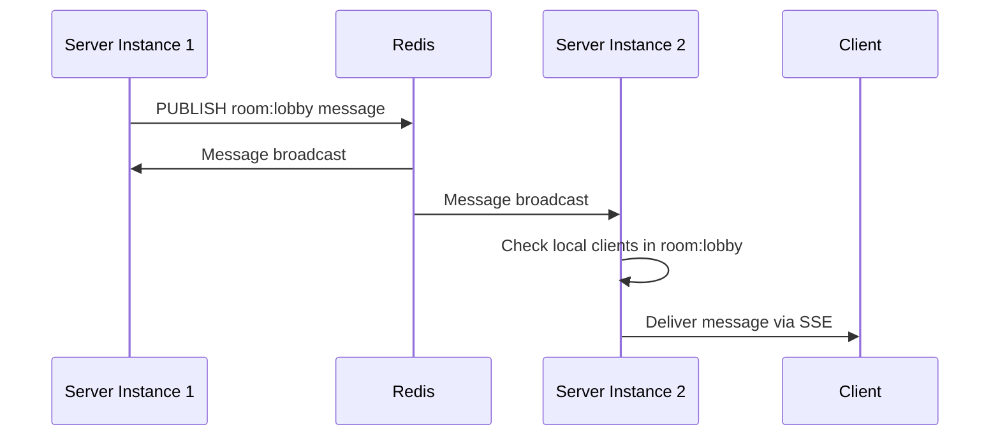

## What are Rooms?

Rooms are a way to group connected clients together so you can broadcast messages to specific subsets of users. This is useful for:

- **Chat applications**: Separate chat rooms
- **Multiplayer games**: Game lobbies or match rooms
- **Dashboards**: Department-specific updates
- **Collaborative editing**: Document-specific notifications

## Basic Usage

### Joining a Room

Clients can join one or more rooms:

```typescript
server.on('connection', (socket) => {
  // Join a single room
  socket.join('lobby');
  
  // Join multiple rooms
  socket.join('game-123');
  socket.join('team-red');
  
  console.log('Joined rooms:', socket.getRooms());
  // Output: Set { 'lobby', 'game-123', 'team-red' }
});
```

### Leaving a Room

Remove a client from a room:

```typescript
socket.on('leaveGame', () => {
  socket.leave('game-123');
  console.log('Left game room');
});
```

### Broadcasting to a Room

Send messages to all clients in a specific room:

```typescript
socket.on('chatMessage', (data) => {
  // Broadcast to everyone in the room (including sender)
  socket.broadcastToRoom('lobby', 'message', {
    user: socket.id,
    text: data.text,
    timestamp: Date.now()
  });
});
```

## Room Membership

### Check Joined Rooms

Get all rooms a socket has joined:

```typescript
const rooms = socket.getRooms();
console.log('Client is in rooms:', Array.from(rooms));
```

### Automatic Cleanup

Rooms are automatically cleaned up when:
- A client leaves a room explicitly
- A client disconnects
- The session expires

## Use Cases

### Chat Application

```typescript
server.on('connection', (socket) => {
  socket.on('joinChannel', ({ channelName }) => {
    socket.join(`channel:${channelName}`);
    
    // Notify others in the channel
    socket.broadcastToRoom(
      `channel:${channelName}`,
      'userJoined',
      { username: socket.id }
    );
  });
  
  socket.on('sendMessage', ({ channel, message }) => {
    socket.broadcastToRoom(
      `channel:${channel}`,
      'newMessage',
      {
        from: socket.id,
        text: message,
        timestamp: Date.now()
      }
    );
  });
  
  socket.on('leaveChannel', ({ channelName }) => {
    socket.leave(`channel:${channelName}`);
    
    socket.broadcastToRoom(
      `channel:${channelName}`,
      'userLeft',
      { username: socket.id }
    );
  });
});
```

### Multiplayer Game Lobby

```typescript
server.on('connection', (socket) => {
  socket.on('createGame', async ({ gameId }) => {
    socket.join(`game:${gameId}`);
    
    // Store game data in Redis
    await redis.hset(`game:${gameId}:data`, {
      host: socket.id,
      status: 'waiting',
      players: JSON.stringify([socket.id])
    });
    
    socket.emit('gameCreated', { gameId });
  });
  
  socket.on('joinGame', async ({ gameId }) => {
    socket.join(`game:${gameId}`);
    
    // Add player to game
    const gameData = await redis.hgetall(`game:${gameId}:data`);
    const players = JSON.parse(gameData.players);
    players.push(socket.id);
    
    await redis.hset(`game:${gameId}:data`, {
      players: JSON.stringify(players)
    });
    
    // Notify all players
    socket.broadcastToRoom(`game:${gameId}`, 'playerJoined', {
      playerId: socket.id,
      totalPlayers: players.length
    });
  });
  
  socket.on('startGame', ({ gameId }) => {
    socket.broadcastToRoom(`game:${gameId}`, 'gameStarted', {
      timestamp: Date.now()
    });
  });
});
```

### Real-Time Dashboard

```typescript
server.on('connection', (socket) => {
  socket.on('subscribe', ({ department, team }) => {
    // Join department-wide room
    socket.join(`dept:${department}`);
    
    // Join team-specific room
    if (team) {
      socket.join(`team:${team}`);
    }
    
    socket.emit('subscribed', {
      rooms: Array.from(socket.getRooms())
    });
  });
  
  // Broadcast updates to specific groups
  socket.on('updateMetric', ({ scope, metric, value }) => {
    if (scope.type === 'department') {
      socket.broadcastToRoom(
        `dept:${scope.id}`,
        'metricUpdate',
        { metric, value }
      );
    } else if (scope.type === 'team') {
      socket.broadcastToRoom(
        `team:${scope.id}`,
        'metricUpdate',
        { metric, value }
      );
    }
  });
});
```

### Collaborative Editing

```typescript
server.on('connection', (socket) => {
  socket.on('openDocument', ({ docId }) => {
    socket.join(`doc:${docId}`);
    
    // Notify others
    socket.broadcastToRoom(`doc:${docId}`, 'userJoined', {
      userId: socket.id,
      timestamp: Date.now()
    });
  });
  
  socket.on('edit', ({ docId, changes }) => {
    // Broadcast changes to all users viewing this document
    socket.broadcastToRoom(`doc:${docId}`, 'documentChanged', {
      userId: socket.id,
      changes,
      timestamp: Date.now()
    });
  });
  
  socket.on('cursor', ({ docId, position }) => {
    // Broadcast cursor position to other viewers
    socket.broadcastToRoom(`doc:${docId}`, 'cursorMoved', {
      userId: socket.id,
      position
    });
  });
  
  socket.on('closeDocument', ({ docId }) => {
    socket.leave(`doc:${docId}`);
    
    socket.broadcastToRoom(`doc:${docId}`, 'userLeft', {
      userId: socket.id
    });
  });
});
```

## Implementation Details

### How Rooms Work

Under the hood, rooms are implemented using:

1. **Session-to-Room Mapping**: Redis sets track which sessions are in which rooms
2. **Room-to-Session Mapping**: Bidirectional mapping for efficient lookups
3. **Redis Pub/Sub**: Room broadcasts use Redis pub/sub channels

```typescript
// Redis keys used for rooms:
// - session:{sessionId}:rooms - Set of rooms for this session
// - room:{roomName} - Set of sessions in this room
// - room:{roomName}:channel - Pub/sub channel for broadcasts
```

### Broadcasting Mechanism

When you call `socket.broadcastToRoom()`:

1. Server publishes message to room's Redis channel
2. All server instances subscribed to that channel receive it
3. Each instance checks if any of its clients are in that room
4. Message is delivered to matching clients via SSE/polling



## Best Practices

### Room Naming

Use consistent naming conventions:

```typescript
// Good: Namespaced room names
socket.join('chat:general');
socket.join('game:match-123');
socket.join('doc:abc-xyz-789');

// Avoid: Generic names that could conflict
socket.join('general');
socket.join('123');
```

### Cleanup

Always clean up when clients leave:

```typescript
socket.on('disconnect', () => {
  // Get all rooms before disconnect
  const rooms = socket.getRooms();
  
  // Notify rooms about departure
  rooms.forEach(room => {
    socket.broadcastToRoom(room, 'userLeft', {
      userId: socket.id
    });
  });
  
  // Rooms are automatically cleaned up,
  // but you may want to do additional cleanup
});
```

### Room Limits

Consider limiting the number of rooms per client:

```typescript
const MAX_ROOMS = 10;

socket.on('joinRoom', ({ roomName }) => {
  const currentRooms = socket.getRooms();
  
  if (currentRooms.size >= MAX_ROOMS) {
    socket.emit('error', {
      message: 'Maximum rooms reached'
    });
    return;
  }
  
  socket.join(roomName);
});
```

### Efficient Broadcasting

For large-scale applications, consider:

```typescript
// Instead of broadcasting to many rooms:
socket.broadcastToRoom('room1', 'event', data);
socket.broadcastToRoom('room2', 'event', data);
socket.broadcastToRoom('room3', 'event', data);

// Consider a single room with filtered messages:
socket.broadcastToRoom('notifications', 'event', {
  ...data,
  targetUsers: ['user1', 'user2', 'user3']
});

// Clients filter on their end:
socket.on('event', (data) => {
  if (data.targetUsers?.includes(myUserId)) {
    handleNotification(data);
  }
});
```

## Advanced Patterns

### Dynamic Room Creation

```typescript
const activeRooms = new Set<string>();

socket.on('createRoom', ({ roomName, options }) => {
  if (activeRooms.has(roomName)) {
    socket.emit('error', { message: 'Room exists' });
    return;
  }
  
  activeRooms.add(roomName);
  socket.join(roomName);
  
  // Store room metadata
  redis.hset(`room:${roomName}:meta`, {
    creator: socket.id,
    createdAt: Date.now(),
    ...options
  });
  
  socket.emit('roomCreated', { roomName });
});
```

### Private Rooms

```typescript
socket.on('createPrivateRoom', async ({ participants }) => {
  // Create unique room ID
  const roomId = `private:${Date.now()}:${crypto.randomUUID()}`;
  
  // Store room access list
  await redis.sadd(`room:${roomId}:allowed`, ...participants);
  
  socket.join(roomId);
  
  // Invite other participants
  participants.forEach(participantId => {
    // Send invitation somehow
  });
});

socket.on('joinPrivateRoom', async ({ roomId }) => {
  const allowed = await redis.sismember(
    `room:${roomId}:allowed`,
    socket.id
  );
  
  if (!allowed) {
    socket.emit('error', { message: 'Access denied' });
    return;
  }
  
  socket.join(roomId);
});
```

## Next Steps

<CardGroup cols={2}>
  <Card
    title="Architecture"
    icon="diagram-project"
    href="/concepts/architecture"
  >
    Learn how rooms work under the hood
  </Card>
  <Card
    title="State Management"
    icon="database"
    href="/concepts/state-management"
  >
    Understand Redis state management
  </Card>
  <Card
    title="Chat Example"
    icon="comments"
    href="/examples/chat-app"
  >
    Build a chat app with rooms
  </Card>
  <Card
    title="API Reference"
    icon="code"
    href="/api-reference/server/server-socket"
  >
    Complete room API reference
  </Card>
</CardGroup>
